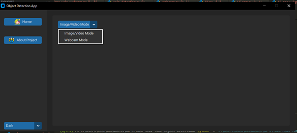
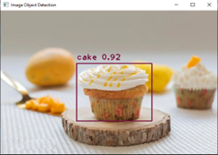

# Object Detection App README

## Overview

This project is a Python-based **Object Detection App** utilizing **YOLOv3** and **CustomTkinter** for a user-friendly GUI. The app supports object detection in images, videos, and real-time webcam feeds. 

## Features
- Real-time object detection with bounding boxes and labels.
- Image/video mode and live webcam mode.
- Modern UI with theme customization.
- Real-time FPS display.
- Interactive sidebar for navigation.

---

## Installation Guide

### 1. Clone the Repository
```bash
git clone https://github.com/Awwal12/ObjectDetectionApp.git
cd ObjectDetectionApp
```

### 2. Set Up Virtual Environment
```bash
python -m venv venv
source venv/bin/activate   # For Linux/Mac
venv\Scripts\activate      # For Windows
```

### 3. Install Dependencies
Run the following command to install the required Python packages:
```bash
pip install -r requirements.txt
```

**`requirements.txt`** includes:
- `opencv-python`
- `numpy`
- `customtkinter`
- `Pillow`

### 4. Download YOLO Weights
You will need two types of weights:  
1. **YOLOv3 Full Weights** [Download here](https://pjreddie.com/media/files/yolov3.weights)  
2. **YOLOv3 Tiny Weights** [Download here](https://pjreddie.com/media/files/yolov3-tiny.weights)

Move the downloaded weights into the `weights` folder in the project directory.

### 5. Download YOLO Configuration Files
Make sure you have the **YOLOv3** configuration files:  
- `yolov3.cfg` for full weights  
- `yolov3-tiny.cfg` for tiny weights  

These files are usually bundled with the weights or can be found [here](https://github.com/pjreddie/darknet).

---

## Running the Application
1. **Activate the virtual environment:**
   ```bash
   source venv/bin/activate  # Linux/Mac
   venv\Scripts\activate     # Windows
   ```

2. **Run the application:**
   ```bash
   python Ui-app.py
   ```

---

## Usage
1. **Home Screen**: Navigate to different modes using the sidebar.


2. **Launch Application**: Select either *Image/Video Mode* or *Webcam Mode*.


3. **Image/Video Mode**: Upload a file to detect objects.
4. **Webcam Mode**: Start real-time object detection via your webcam.

### About Section
Learn more about the project and its capabilities in the **About Project** tab.

---
## Application in action

### Before dectecion


### After detection



---

## Troubleshooting
- **Missing dependencies**: Ensure you installed all packages via `requirements.txt`.
- **Weight files not found**: Verify that the weight files are in the correct `weights` folder.
- **Webcam issues**: Ensure your webcam is functional and accessible.

---

## License
This project is licensed under the [MIT License](https://opensource.org/licenses/MIT).

## Contributing
Feel free to fork this repository and submit pull requests. For major changes, open an issue to discuss.

--- 

**Happy Coding!**